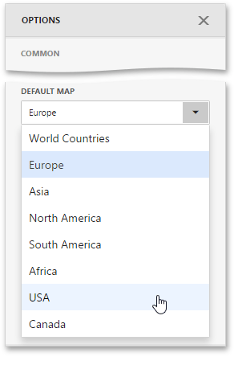
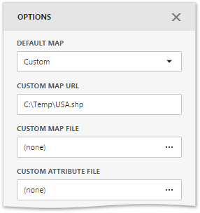

# Providing Maps
This topic describes how to use the default **Risky Dashboard** maps and configure their attributes.
* [Default Maps](#defaultmaps)
* [Custom Maps](#custommaps)

## <a name="defaultmaps"/>Default Maps
The **Risky Dashboard**  ships with a set of default maps showing various parts of the world. The following maps are included.
* **World Countries** - a map of the world
* **Europe** - a map of Europe
* **Asia** - a map of Asia
* **North America** - a map of North America
* **South America** - a map of South America
* **Africa** - a map of Africa
* **USA** - a map of the USA
* **Canada** - a map of Canada

> [!NOTE]
> The **World Countries** map has a lower level of detail than maps of specific regions and may not contain some of the countries. As an alternative, you can load a custom map with required granularity.

To select a required default map, go to the [Options](../../ui-elements/dashboard-item-menu.md) menu and use the **Default Map** dropdown list located in the **Common** section.

## <a name="custommaps"/>Custom Maps
The Web Dashboard uses a **Shapefile** vector format to provide custom maps. Commonly, this format includes two file types:
* **.shp file** - holds map shapes (points/lines/polygons)
* **.dbf file** - contains attributes for each shape.

To provide a custom map, go to the **Common** section of the [Options](../../ui-elements/dashboard-item-menu.md) menu and change the **Default Map** value to **Custom**.

Finally, provide shape data using one of the following ways.
* Specify the path to the **.shp** file using the **Custom Map URL** option. Attributes from the corresponding **.dbf** file located in the same directory will automatically be included in the map.
* Load the existing shapefile using the ellipsis button next to the **Custom Map File** option. In the invoked dialog, locate the required **.shp** file. Use the **Custom Attribute File** option to locate the **.dbf** file containing attributes for each shape.

Note that custom maps created in the Cartesian coordinate system are not supported.