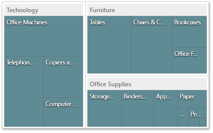
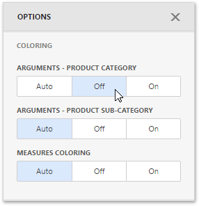

# Coloring
Treemap provides the capability to color its tiles by associating dimension values/measures and specified colors. You can choose whether to use a global color scheme to provide consistent colors for identical values or specify a local color scheme for each dashboard item. To learn more about coloring concepts common for all dashboard items, see [Coloring](../../appearance-customization/coloring.md).

By default, the Treemap dashboard item colors its tiles in the following way.
* If the Treemap contains only measures (the _Values_ section), values corresponding to different measures are colored by different hues.
* If the Treemap contains arguments (the _Arguments_ section), values corresponding to the first argument are colored by different hues.

If necessary, you can change the default behavior. For example, the image below shows the Treemap dashboard item whose measures and argument values are painted with the same color.

To change the default coloring behavior, go to the **Coloring** section of the Treemap's [Options](../../ui-elements/dashboard-item-menu.md) menu.

> [!NOTE]
> You can change the default palette used to color Treemap tiles. For this, go to the **Color Scheme** section of the Treemap's **Options** menu.