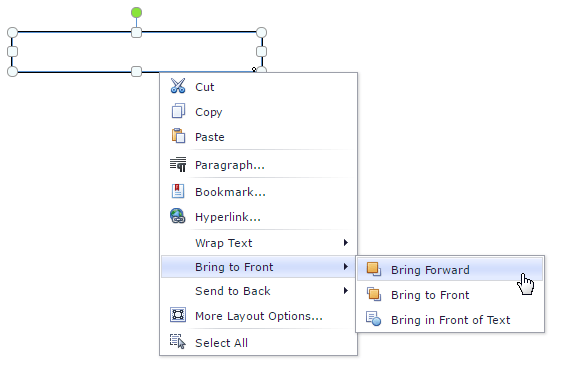
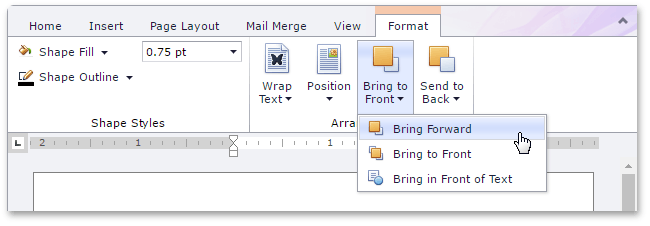

# Move a Picture or Text Box
## Move a Picture or Text Box
1. [Select](insert-select-copy-or-delete-a-picture-or-text-box.md) a floating picture or text box that you wish to move.
2. Drag the object to the new location.

## Move a Picture or Text Box Forward or Backward
When you add floating objects into a document, they are automatically inserted in particular layers. Objects can overlap. In this case, the top object covers lower objects (in full or in part). You can move particular objects up and down in a stack one layer at a time, or move them to the top or bottom of a stack in one click.
1. [Select](insert-select-copy-or-delete-a-picture-or-text-box.md) a floating picture or text box that you wish to move up or down in the stack.
2. Select the required item from the floating object's context menu...
	
	
	
	... or **Format** tab.
	
	
* To move the selected floating object one layer forward to the front, click **Bring to Front -> Bring Forward**.
* To move the selected floating object in front of the text layer and any other floating objects, **Bring to Front -> Bring to Front**.
* To move the selected floating object in front of the text layer, click **Bring to Front -> Bring in Front of Text**.
* To move the selected floating object one layer forward to the back, click **Send to Back -> Send Backward**.
* To move the selected floating object behind the text or any other floating object, click **Send to Back -> Send to Back**.
* To move the selected floating object behind the text layer, click **Send to Back -> Send Behind Text**.