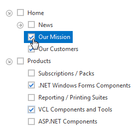
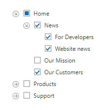

# Tree View Nodes Checking
Click a checkbox to toggle the node's checked state.

**Recursive Checking**

When you check a node in recursive checking mode, it automatically checks all its immediate child nodes, and vice versa.

